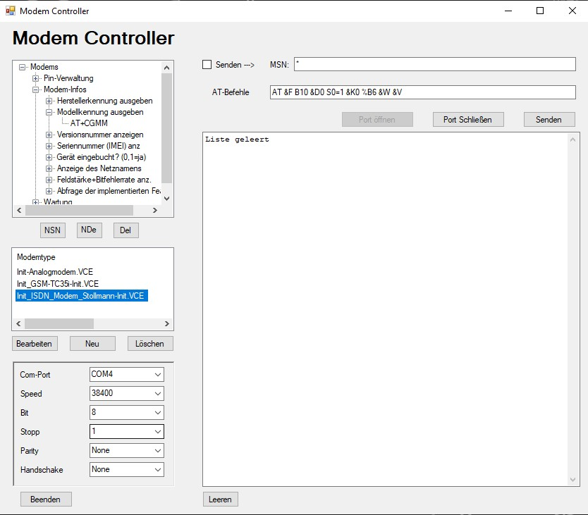
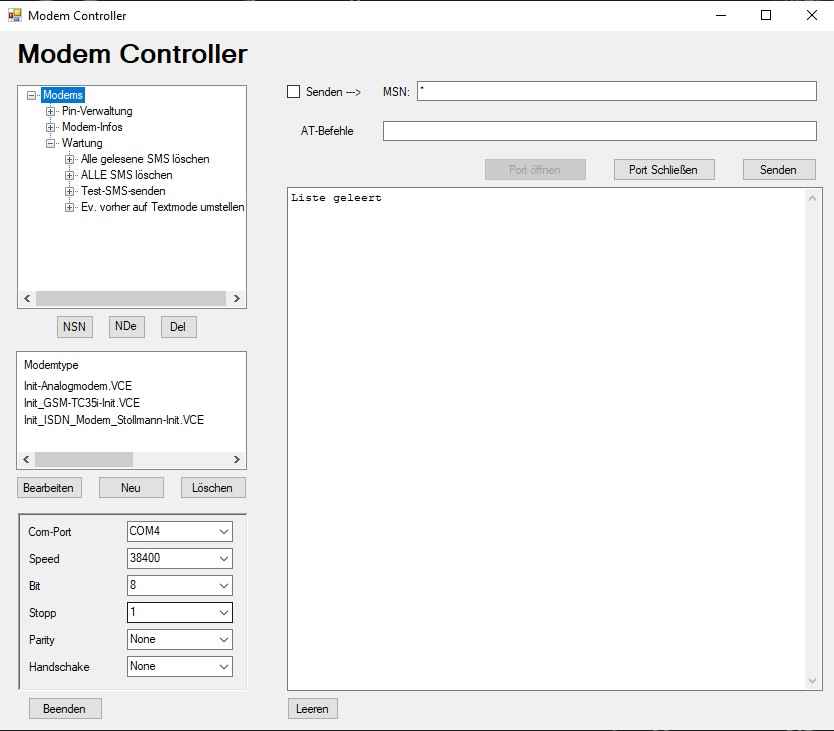

# ModemControllerRS232

<!-- markdownlint-disable MD033 -->
<!-- markdownlint-disable MD001 -->
<!-- markdownlint-disable MD013 -->
<!-- markdownlint-disable MD025 -->
<!-- markdownlint-disable MD026 -->

This small program is used to control a modem via RS232. It is written in VB.NET and uses the .NET Framework 4. It is a Windows Forms application.

You can write AT commands to the modem and read the response directly in the Terminal field. You can also save the commands to a file.

I wrote the program because Windows 7 no longer has HyperTerminal. I needed a terminal to control a modem via RS232.

Lately, I have only updated it to newer .NET Frameworks. (Don't touch a running system :-) )

the .7z file contains the runnig Program and my Presets. You don't need to install anything. Just extract the .7z file and run the ModemController.exe file.

 
 

---

## Screenshots

 
 

---

## Donate

<table align="center" width="100%" border="0" bgcolor:=#3f3f3f>
<tr align="center">
<td align="center">  
if you prefer a one-time donation

</td>

<td align="center">  
Become a patron, by simply clicking on this button (**very appreciated!**):

</td>
</tr>
</table>

 
 

---

## Copyright

`2013-2023 (c)Vitaly Ruhl`

License: GNU General Public License v3.0

