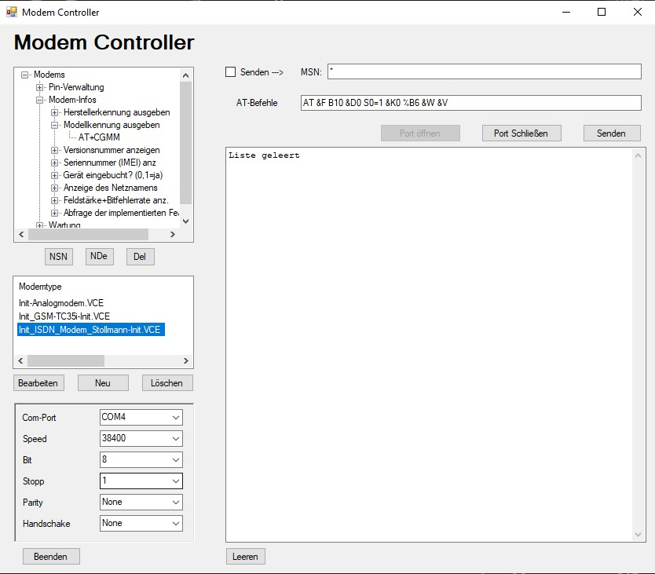
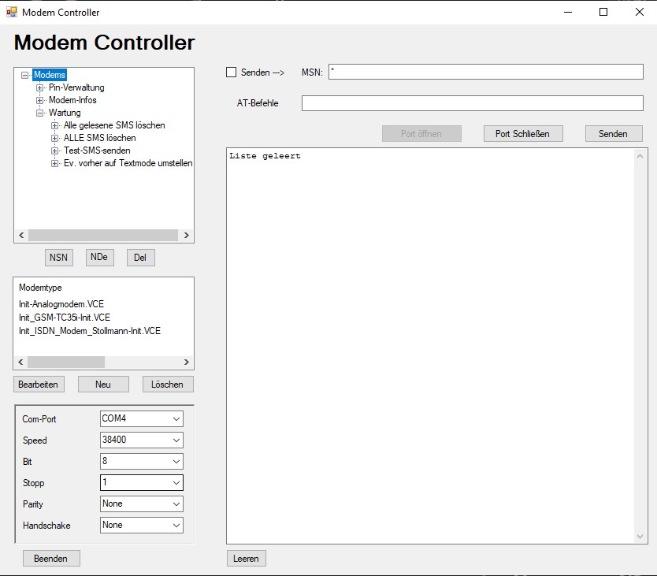

# ModemControllerRS232

A Windows modem terminal being prepared for a Python rewrite with PySide6 and
pySerial. The repository contains an **application scaffold** and the preserved
VB.NET application. The Python package has a reproducible development baseline,
but no application behavior yet.

The intended application is a compact diagnosis tool for text-based AT modems,
with category buttons, visible profile notes and optional hex inspection, not a
general-purpose terminal replacement. See the [documentation index](docs/README.md)
for the consolidated AT reference and device manuals.

## Repository layout

```text
.
|-- .Old_Version/            Preserved VB.NET sources and released applications
|-- docs/
|   |-- README.md           Documentation and reference index
|   |-- reference/          AT text reference, device manuals and driver references
|   `-- images/             Legacy screenshots
|-- src/modem_controller/
|   |-- app.py              Future application composition
|   |-- ui/                 Desktop views and user interaction
|   |-- transport/          Serial-port access and byte capture
|   |-- protocol/           Response framing and AT session processing
|   |-- catalog/            Commands, profiles, persistence, and legacy import
|   `-- workflows/          Connection search and diagnostic sequences
|-- tests/                  Reserved unit and integration test directories
|-- tools/                  Reserved development and packaging utilities
`-- pyproject.toml          Initial Python package metadata
```

The Python modules are deliberately empty. GUI behavior, executable entry points,
and hardware access have not been implemented or validated. Version `0.0.0` is a
scaffold marker, not a release.

## Development baseline

Python 3.12 or 3.13 is required. The locked baseline uses PySide6 6.8.3,
pySerial 3.5, PyInstaller 6.12.0, pytest 8.3.5, pytest-qt 4.4.0, and Ruff 0.11.2.

```powershell
uv sync --frozen
uv run ruff check .
uv run ruff format --check .
uv run pytest
uv build
```

The planned target is Windows 10 20H2 x64 and newer. The baseline establishes a
repeatable development environment; packaged Windows compatibility is deferred to
the packaging milestone.

## Existing application

The previous source tree and releases remain under [.Old_Version](.Old_Version/).
The original portable archive is
[ModemController_V1.5.0.10.7z](.Old_Version/ModemController_V1.5.0.10.7z).
The legacy application uses VB.NET/Windows Forms; the inspected source targets
.NET Framework 4.0. It was created as an RS232 terminal after HyperTerminal was
absent from Windows 7. It supports manual AT entry, replies and stored commands.
The archive contains the previous executable and presets: extract it and launch
`ModemController.exe`; its runtime has not been retested here.




Keep legacy sources and releases as migration references. Their runtime behavior
has not been retested after the directory move. Shortcuts containing absolute
paths may need local adjustment.

## Development boundaries

Keep GUI code separate from serial transport, protocol processing, catalog data,
and workflow orchestration. Unit and simulator tests belong in `tests/`; real
hardware and clean-target Windows evidence remain separate acceptance activities.

## License

GNU General Public License v3.0. See [LICENSE](LICENSE).
